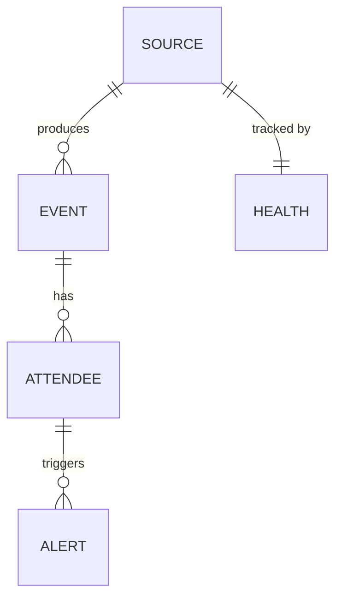

# Conference Scraper — Data Structures

> The core entities the pipeline creates, stores, and queries.

---



---

## Events

The central entity. A conference, summit, or meetup where target executives might attend or present.

| Field | Type | Description |
|---|---|---|
| `event_id` | string | Normalized name + month + city (dedup key) |
| `name` | string | Official event name |
| `date_start` / `date_end` | date | ISO 8601 |
| `date_raw` | string | Original string for debugging parse failures |
| `city` / `country` / `venue` | string | Location fields |
| `is_virtual` | boolean | Online-only flag |
| `tier` | enum | `tier_1` (major), `tier_2` (industry), `tier_3` (regional) |
| `extraction_confidence` | float | 0–1, from the LLM |
| `canonical_id` | string | Set after dedup — groups same event from different sources |

---

## Attendees

A person associated with a conference — whether they're presenting, speaking on a panel, or simply registered/spotted as attending. Matching their company against the target list is the pipeline's whole purpose.

| Field | Type | Description |
|---|---|---|
| `name` | string | Full name as listed |
| `title` | string | Job title |
| `company` | string | As listed on the page |
| `company_normalized` | string | Cleaned for matching ("Anthropic, Inc." → "Anthropic") |
| `is_presenting` | boolean | True if speaking, keynoting, or on a panel. False if just attending. |
| `session_title` | string | Talk/panel title if presenting |
| `event_id` | string | FK to event |

The `is_presenting` flag matters for alert priority — a CEO giving a keynote is a stronger signal than a CEO who's just attending.

---

## Source Registry

Configuration table for the scheduler — what to scrape, when, and how.

| Field | Type | Description |
|---|---|---|
| `source_id` | string | Unique identifier |
| `url` | string | Target URL |
| `frequency` | enum | `daily` / `weekly` / `biweekly` / `monthly` — agent-determined |
| `scraper_version` | int | Increments on each repair |
| `status` | enum | `active` / `needs_repair` / `needs_manual_review` / `tombstoned` |
| `last_scraped` / `next_due` | datetime | Scheduling fields |

---

## Source Health

Tracks success/failure patterns to trigger repair or human escalation.

| Field | Type | Description |
|---|---|---|
| `consecutive_failures` | int | Resets to 0 on success. ≥3 triggers repair agent. |
| `repair_attempts` | int | ≥5 triggers human escalation |
| `last_error` | string | Most recent failure message |

---

## Alerts

Weekly Slack digests grouped by event, with threaded detail per event for partner interaction.

### Top-Level Alert (Weekly Digest)

The pipeline sends one digest message per partner channel per week, listing all events with matched attendees:

```
📅 Weekly Event Intelligence — March 3, 2025

3 events with portfolio company attendees this week:

🎤 TechCrunch Disrupt 2025 — Oct 28-30, San Francisco
   • Dario Amodei (CEO, Anthropic) — Keynote: "The Future of AI Safety"
   • Harrison Chase (CEO, LangChain) — Attending

🎤 SaaStr Annual 2025 — Sep 10-12, San Francisco
   • Arvind Jain (CEO, Glean) — Panel: "Enterprise AI in Practice"

🎤 DevConnect 2025 — Nov 5-7, Amsterdam
   • Maxim Fateev (CEO, Temporal) — Attending

📊 3 events | 4 matched attendees | Trace: run-2025-03-01-abc
```

### Threaded Replies (Per Event)

Each event in the digest gets a threaded reply with full detail and interactive elements:

```
🎤 TechCrunch Disrupt 2025

📅 October 28-30, 2025 — Moscone Center, San Francisco
🔗 techcrunch.com/events/disrupt-2025
📊 Confidence: High | Sources: 3

Matched attendees:
  • Dario Amodei, CEO — Anthropic (🎙️ Presenting)
    Keynote: "The Future of AI Safety"
  • Harrison Chase, CEO — LangChain (👤 Attending)

📆 Not on your calendar

React:
  ✅ — Added to calendar
  🔇 — Mute this event type in the future
  ⭐ — High priority, flag for follow-up
```

### Calendar Cross-Reference

Before surfacing an event, the pipeline checks the partner's calendar (Google Calendar / Outlook via API). If the partner is already committed to the event, the alert notes "✅ Already on your calendar" instead of "📆 Not on your calendar" — so partners aren't bothered about events they already know about.

### Alert Tracking

| Field | Type | Description |
|---|---|---|
| `event_id` + `attendee_name` | string | Dedup key — don't re-alert |
| `partner_channel` | string | Slack channel |
| `run_id` | string | Trace back to pipeline run |
| `partner_reaction` | string | Emoji reaction if any (⭐, 🔇, ✅) |
| `on_calendar` | boolean | Was the event already on the partner's calendar? |

Partner reactions feed back into the system: 🔇 on an event type (e.g. regional meetups) trains future filtering. ⭐ flags priority for the team.

---

## Target Companies

Maintained by the investment team. Drives all matching.

| Field | Type | Description |
|---|---|---|
| `name` | string | Primary company name |
| `ceo` | string | Key executive to watch for |
| `aliases` | list | Alternative names for fuzzy matching |
| `partner` | string | Partner who covers this company |
