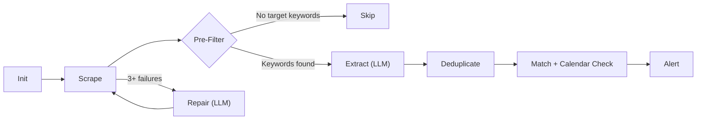

# Conference Scraper — Pipeline

> What each stage does, from source discovery to partner alert.

---

Five of seven stages are plain Python — no LLM, no cost. Only extract and repair call a model, and repair only fires when something is broken.

---

**Init.** Load the source registry and target company list. Filter to sources that are due — a source set to "monthly" that was scraped last week gets skipped.

**Scrape.** Run all due scrapers in parallel. Each is a deterministic Python function (httpx + BeautifulSoup) that returns cleaned text. Individual failures don't block the pipeline — they increment a failure counter. If content exceeds 15K tokens, it's flagged as a scraper error.

**Pre-filter.** Fast in-memory keyword check: does any target company or executive name appear in the raw text? No match → skip and tombstone (won't re-scrape for 30 days). This prevents 90% of pages from ever touching an LLM.

**Extract** ([complexity 2–3](../cost-and-observability/model-selection.md)). A fast/cheap model converts cleaned HTML into structured JSON — event name, dates, location, attendees (with an `is_presenting` flag distinguishing speakers/panelists from general attendees). Input capped at 8K tokens. The model rates its own confidence; low-confidence extractions get flagged downstream.

**Repair** ([complexity 8–9](../cost-and-observability/model-selection.md), conditional). Only fires after 3+ consecutive failures. A premium model receives the broken scraper code, error log, and snapshot test expectations. It navigates the site, diagnoses the change, and writes a new scraper + test. Capped at 10 steps — if it can't fix it, it escalates to a human via Slack.

**Deduplicate.** Merge events from multiple sources. "TechCrunch Disrupt SF 2025" and "TC Disrupt San Francisco" resolve to the same event using normalized name + month + city plus fuzzy string matching. Attendee lists merge with provenance tracking.

**Match + Calendar Check.** Check each attendee's company against the target list (fuzzy matching). For matches, cross-reference the relevant partner's calendar — if they're already committed to the event, the alert marks it accordingly.

**Alert.** Matched events are grouped into a weekly Slack digest per partner channel, with threaded replies per event. Partners can react with emoji to flag priority (⭐), mute event types (🔇), or confirm calendar additions (✅). See [data structures](data-structures.md#alerts) for the full alert format.

---

## Cost Summary

| Stage | LLM? | Cost |
|---|---|---|
| Init / Scrape / Pre-filter / Dedup / Match / Alert | No | $0 |
| **Extract** | Yes (fast/cheap) | ~$0.01/page |
| **Repair** | Yes (premium, rare) | ~$0.15/repair |

At 500 sources: **~$1/week**. Full breakdown in the [cost model](cost.md).

**Timing:** The whole pipeline runs in 15–45 seconds (scraping and extraction in parallel).
