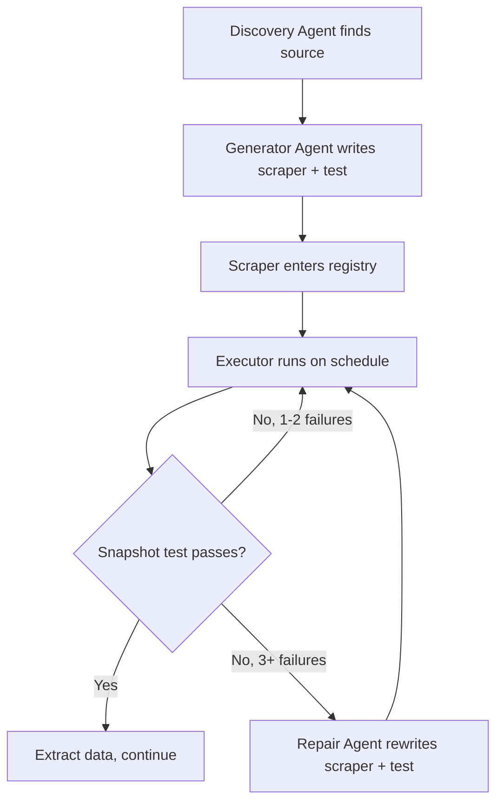

# Scraper Lifecycle

> How scrapers are born, tested, scheduled, and healed.

---

Traditional web scrapers are static code that breaks silently. L'oeil treats scrapers as living artifacts with a managed lifecycle:

---

## Generation

When a new conference source is discovered (via web search, Twitter/LinkedIn posts about upcoming speaking engagements, or manual addition), a [premium-tier](../cost-and-observability/model-selection.md) agent:

1. Navigates the site with browser-use to understand the page structure
2. Writes a **deterministic scraper** (Python + BeautifulSoup or Playwright)
3. Writes a **snapshot test** — structural assertions about expected output
4. Estimates a **scraping frequency** based on how often the content changes

The agent produces three artifacts per source: scraper code, a snapshot test, and a configuration entry (URL, frequency, rationale).

---

## Snapshot Tests

Each scraper has a test that validates two things:

**Structural assertions** — does the scraper return data in the expected shape? If these fail, the scraper is broken (the page layout changed).

**Content drift detection** — do known-good values still hold? If structural tests pass but content changes, the page legitimately updated (new speakers, new dates) — that's expected, not an error.

| Structural Test | Content Test | Meaning | Action |
|---|---|---|---|
| ✅ Pass | ✅ Pass | Working, no changes | Continue |
| ✅ Pass | ❌ Fail | Page content updated | Log, update baseline |
| ❌ Fail | — | Scraper broken | Increment failure counter |

This distinction is the core insight: **structural drift = broken scraper, content drift = the world changed.** Without it, every page update looks like a failure.

---

## Frequency Detection

The generator agent determines how often to scrape each source by inspecting the page:

| Signal | Suggested Frequency |
|---|---|
| Event 6+ months away | Monthly |
| Event < 2 months away | Weekly |
| Aggregator with many events | Weekly |
| Static "about our event" page | Monthly |
| RSS/Atom feed available | Match feed cadence |

This matters for cost: a monthly scraper costs 1/4 as much as a weekly one. If 40% of 500 sources only need monthly scraping, that's 200 fewer runs per week.

---

## Self-Healing

When a scraper fails structural tests 3+ consecutive times:

1. The repair agent receives the old scraper code, error history, and snapshot expectations
2. It navigates the current page with browser-use
3. It identifies what changed (renamed CSS classes, new JS rendering, restructured DOM)
4. It writes a new scraper + updated snapshot test
5. The new scraper runs immediately to validate

**Budget:** Max 10 agent steps per attempt. Max 3 attempts per source per week. If all fail, the source gets escalated to a human via Slack and marked `needs_manual_review`. Every version is archived for debugging.
