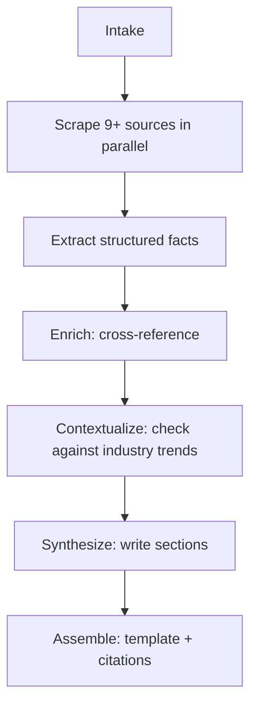

# Research Memo — Pipeline

> What each stage does, from triggering signal to polished memo.

---

Two stages are deterministic (intake, scrape). Four use an LLM at increasing [complexity tiers](../cost-and-observability/model-selection.md). Assembly is a template.

---

**Intake.** Receives the trigger — company name, domain, triggering signal (e.g. "85% QoQ headcount growth"), CRM notes. Validates the request and assembles a research brief. No LLM.

**Scrape.** Nine source scrapers run concurrently: company website, GitHub, news (Tavily/DuckDuckGo), Crunchbase, Apollo (team/employment data), Twitter (founder posts, company mentions), LinkedIn (team composition, hiring signals), job postings, and ProductHunt. Each is a deterministic Python function. If any source fails, the pipeline continues with available data and flags the gap.

**Extract** ([complexity 2–3](../cost-and-observability/model-selection.md)). Each source's raw content goes to a fast/cheap model with a source-specific prompt that pulls structured facts: company info from the website, repo stats from GitHub, funding rounds from Crunchbase, team composition from Apollo, etc. Input per source capped at 5K tokens. The model uses `null` for anything it can't find and never invents data.

**Enrich** ([complexity 6–7](../cost-and-observability/model-selection.md)). All structured facts go together to a mid-tier model for cross-referencing: find patterns ("hiring heavily in sales → GTM push"), flag contradictions ("Crunchbase says $30M, TechCrunch says $35M"), identify gaps ("no revenue data found"), derive metrics (funding per employee, star growth rate), and score overall confidence.

**Contextualize** ([complexity 5–6](../cost-and-observability/model-selection.md)). The enriched findings are checked against a curated RAG-indexed collection of industry trend reports — Gartner analyses, VC/PE market macro essays, thought leadership pieces. The model identifies which macro trends the company aligns with (or bucks), strengthening the "why now" thesis with external validation beyond the company's own data.

**Synthesize** ([complexity 8](../cost-and-observability/model-selection.md)). A premium model writes seven memo sections, each with a tailored prompt: executive summary, company overview, market context (incorporating trend alignment), signal analysis, why now, risks (adversarial: "argue against this investment"), and recommendation. Every prompt includes: "Base your analysis ONLY on the provided facts."

**Assemble.** Jinja2 template renders the final Markdown memo with a data quality banner ("Based on 8/9 sources. Gaps: [list]"), source citations on every claim, contradiction flags in the appendix, and a trace ID linking back to the full pipeline run.

---

## Cost & Timing

| Stage | [Model tier](../cost-and-observability/model-selection.md) | Cost |
|---|---|---|
| Intake + Scrape | None | ~$0.05 (API fees) |
| **Extract** | Fast/cheap | ~$0.02 |
| **Enrich** | Mid-tier | ~$0.05 |
| **Contextualize** | Mid-tier | ~$0.03 |
| **Synthesize** | Premium | ~$0.14 |
| Assemble | None | $0 |
| **Total** | | **~$0.30-0.55/memo** |

End-to-end: **45 seconds to 2 minutes** (scraping and extraction in parallel).
